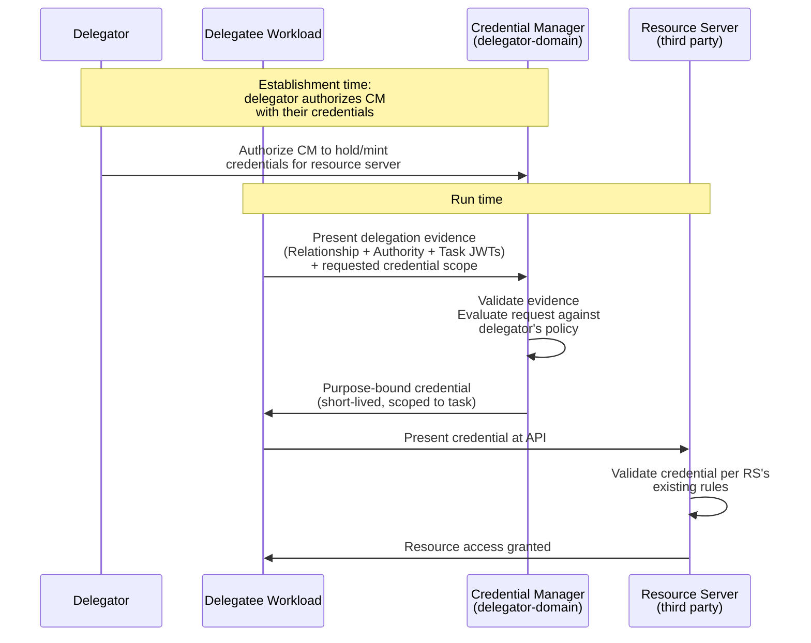
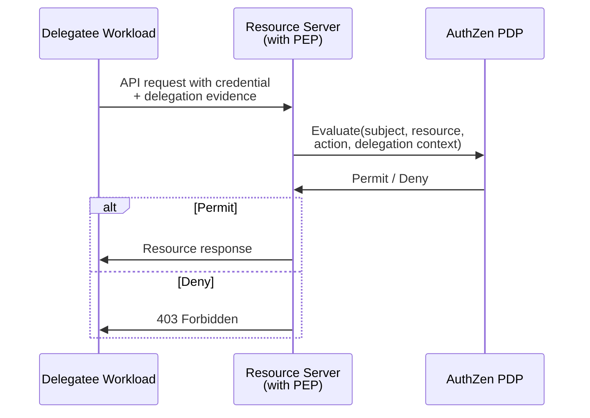
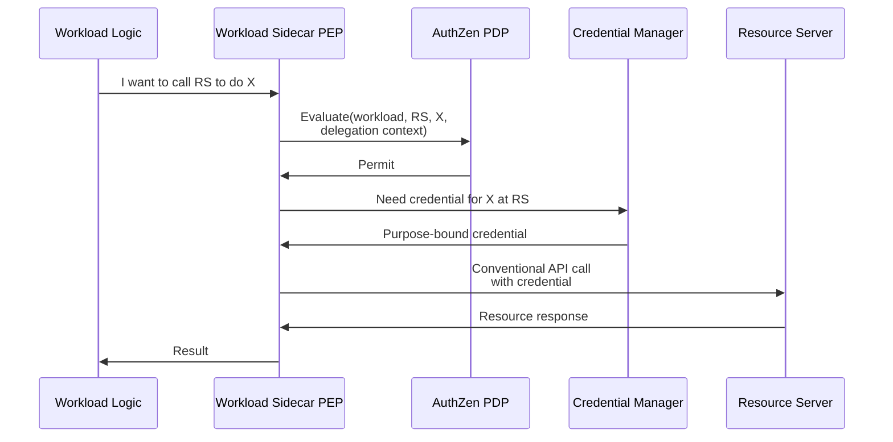
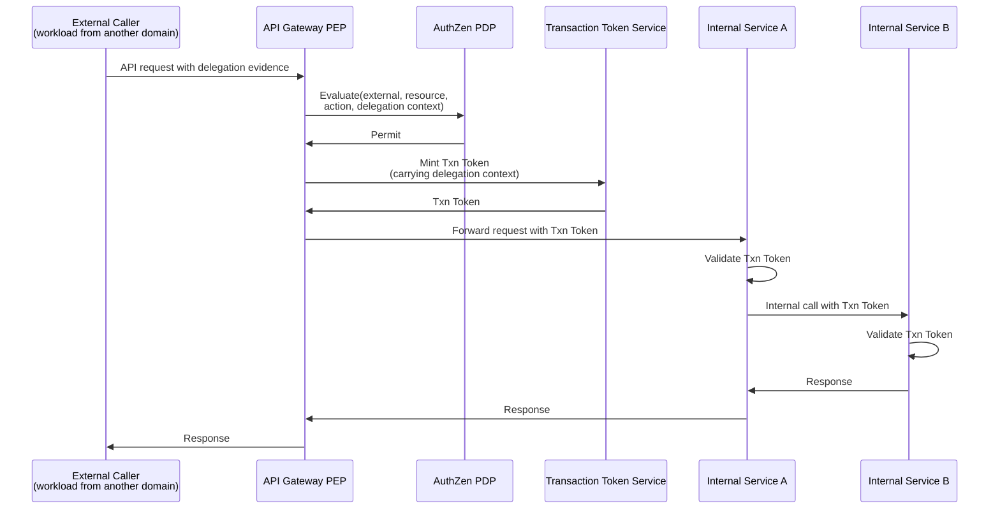
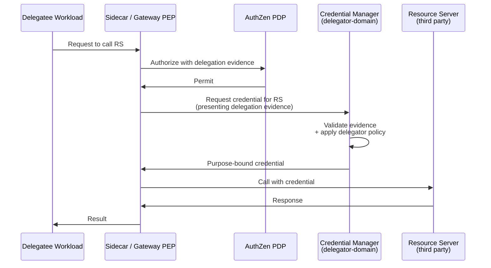
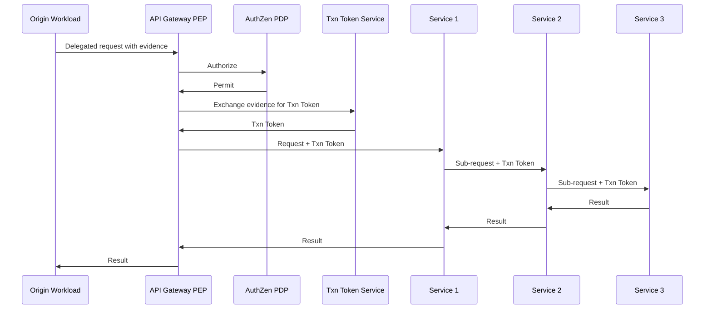
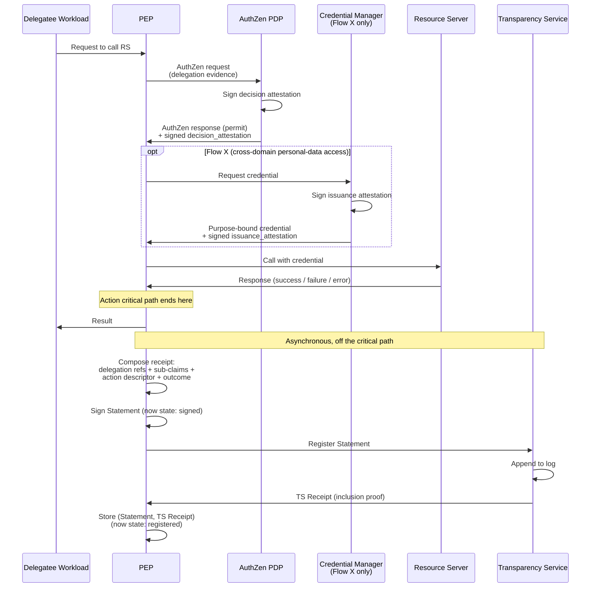

# Delegated Authorization Execution Layer

**Working draft v0.2 — Permissioned Capabilities, Protected Access, and Action Receipts**

*Companion document to the Delegated Authorization Reference Architecture (currently v1.4) and the Privacy-Preserving Profile v1.0.*

*This is an exploratory draft. The execution layer is bleeding-edge work and the patterns here should be pressure-tested before any wire-protocol commitments are made.*

## Per-revision changelog

### v0.2 — Action Receipts and the Transparency Service

- **Filename convention changed**: `execution/execution_layer_v0.1.md` was renamed to `execution/execution_layer.md`. The version is carried in this header and in the per-revision changelog, not in the filename. This matches the convention adopted by the Reference Architecture at v1.2 (see repo `CHANGELOG.md`).
- **New §3.8 Transparency Service role**: enterprise-owned by default, per-trust-domain. The substrate that records receipts produced by the rest of the execution layer.
- **§3.2 (PDP), §3.3 (PEP), §3.5 (Credential Manager) extended** with receipt-related responsibilities: PDP signs a decision attestation; CM signs an issuance attestation; PEP composes the receipt and is the SCITT Issuer that registers it with the TS.
- **New §6 Action Receipts and the Transparency Service**: structural specification of four statement classes (`delegation:action-receipt`, `delegation:deny-receipt`, `delegation:mint-event`, `delegation:revocation-receipt`), the multi-signer composition pattern (PEP composes; PDP and CM sign sub-claims included by value), asynchronous TS registration with `signed` and `registered` verification states, the receipt-access query mechanism for delegators and other rights-bearing parties, COSE/JOSE format choice deferred to a follow-up profile, and the failure-receipts RECOMMEND posture. Addresses Patrick Parker's "no receipt, no trust" critique on Article 1 of the LinkedIn series and `memory/PROJECT_MEMORY.md` Open Question §10.2.8.
- **§7 (was §6) renumbered**: previous §6 Three AuthZen Deployment Models → §7.
- **§8 (was §7) renumbered** and extended with **§8.3 Flow Z: Receipt Generation**, showing the sub-claim signing, composition, and asynchronous registration sequence end-to-end. Previous §7.3 (Flows X and Y combined) → §8.4; previous §7.4 (Honest Acknowledgement) → §8.5.
- **§9 (was §8) and §11 (was §10) renumbered**.
- **§10 (was §9) Open Questions** extended with four new entries: synchronous-registration profile (§10.11), receipt retention policy (§10.12), Privacy-Preserving Profile composition for receipts (§10.13), cross-domain paired-registration protocol (§10.14).
- **§11 (was §10) References** updated with IETF SCITT (Supply Chain Integrity, Transparency, and Trust).

### v0.1 — Initial draft

Initial framing of Permissioned Capabilities (AuthZen pattern) and Protected Access (Credential Manager pattern) as integration patterns rather than new credential formats. Two execution flows (Flow X cross-domain, Flow Y within-domain). Three PEP deployment models. Five pressure-test scenarios. Wire-protocol details deliberately deferred.

**Editorial note (post-v0.1):** The execution-layer components were renamed before v0.2 — *Delegated Capabilities* → **Permissioned Capabilities** and *Delegated Access* → **Protected Access** — and references to components by ordinal number were replaced with references by name. The rename reflects that "delegated access" is conventionally associated with share-access patterns rather than the broader cross-trust-domain credential pattern intended here.

---

## Table of Contents

1. [Introduction](#1-introduction)
2. [Framing: Integration Patterns, Not New Credentials](#2-framing-integration-patterns-not-new-credentials)
3. [Architectural Roles in the Execution Layer](#3-architectural-roles-in-the-execution-layer)
4. [Permissioned Capabilities — The AuthZen Pattern](#4-permissioned-capabilities--the-authzen-pattern)
5. [Protected Access — The Credential Manager Pattern](#5-protected-access--the-credential-manager-pattern)
6. [Action Receipts and the Transparency Service](#6-action-receipts-and-the-transparency-service)
7. [Three AuthZen Deployment Models](#7-three-authzen-deployment-models)
8. [The Three Execution Flows](#8-the-three-execution-flows)
9. [Pressure-Test Scenarios](#9-pressure-test-scenarios)
10. [Open Questions](#10-open-questions)
11. [References](#11-references)

---

## 1. Introduction

### 1.1 Purpose of This Document

The base Reference Architecture (currently v1.4) defines four components that describe a delegation: who the parties are (Relationship), why the delegator may delegate (Authority), what the specific task is (Obligations), and within what bounds it must be performed (Constraints). The Privacy-Preserving Profile defines how those credentials are handled when the delegation involves vulnerable populations.

This document addresses the **execution layer** — **Permissioned Capabilities** and **Protected Access** — which are the runtime patterns that translate the abstract delegation into concrete authorization decisions and credential issuances. Unlike the delegation components (Relationship, Authority, Obligations, Constraints), the execution layer is primarily about **integration with existing authorization infrastructure**, not about defining new credential formats.

### 1.2 Status

This is a v0.1 working draft that records the current thinking. Several of its claims are tentative and several open questions remain unresolved. The intent is to provide a foundation for pressure-testing the deployment model, not to specify a finished architecture. Wire-protocol details are deliberately deferred; this document describes *what* parties do and *which patterns* govern their interaction, not *how exactly* messages are framed on the wire.

### 1.3 Relationship to Other Specifications

This document references and builds upon:

- **Delegated Authorization Reference Architecture** (currently v1.4; `specs/reference_architecture.md`) — the four-component model this layer executes
- **Privacy-Preserving Profile v1.0** — the layered profile that constrains what flows through the execution layer when vulnerable populations are involved
- **OpenID AuthZen (OpenID Authorization API 1.0)** — the authorization decision API used by Permissioned Capabilities
- **OAuth 2.0 Transaction Tokens** *(IETF draft)* — the within-trust-domain workload-chain pattern
- **OpenID for Verifiable Credential Issuance (OID4VCI)** — a candidate inspiration for the Credential Manager's issuance protocol
- **RFC 8693** — OAuth 2.0 Token Exchange, considered but not adopted as the Credential Manager's primary pattern (see §5.4)

---

## 2. Framing: Integration Patterns, Not New Credentials

### 2.1 What the Execution Layer Is Not

The execution layer is not a new credential format. It does not introduce a new JWT type, a new claim vocabulary, or a new wire protocol that competes with existing standards. Permissioned Capabilities and Protected Access are not new things to issue; they are existing things, used in patterns shaped by the delegation components.

This framing is deliberate. The IETF and OpenID Foundation ecosystems already provide rich machinery for runtime authorization decisions (AuthZen, OPA, XACML, Cedar) and for credential issuance (OAuth 2.0, OID4VCI, VC Data Model). The execution layer's contribution is to define how the abstract delegation expressed by the delegation components plugs into that machinery — not to replace it.

### 2.2 What the Execution Layer Is

The execution layer specifies:

- **Roles** that operate at runtime: AuthZen PDP, Credential Manager, Transaction Token Service, PEP variants
- **Patterns** for how delegation evidence (Relationship, Authority, and Task JWTs) is presented to those roles
- **Trust relationships** between the delegator, the delegatee, and the various execution-layer parties
- **Sequence flows** showing how a delegated action proceeds end-to-end, from initiation to resource access
- **Audit obligations** at the execution layer that complement the audit trail held by the verification intermediary in privacy-preserving deployments

### 2.3 Possible Small Additions

Although the bias is toward zero new JSON, two small structures may emerge as useful:

- A **Delegation Evidence Bundle** — a transport wrapper that packages the relevant delegation-component credentials together with integrity protection, for presentation to AuthZen or to a Credential Manager. This is not a new credential type; it is a JWS-signed envelope around existing credentials.
- A **Delegation Context Object** for AuthZen — a structured representation of the delegation evidence as an AuthZen `context` field value, so that PDPs receive the evidence in a predictable, parseable form.

Neither of these is normatively committed to in this draft; both are candidates for resolution after pressure-testing.

---

## 3. Architectural Roles in the Execution Layer

This section enumerates the roles that operate at runtime. Each role is described in terms of its **trust properties** and **functions**, not its physical deployment — a single regulated entity may play multiple roles, and a single role may be implemented across multiple deployed components.

### 3.1 The Delegatee Workload

The party that actually performs the delegated task. May be:

- A natural person operating through a client application
- An autonomous AI agent
- A human-controlled tool (a clinician's order entry system)
- A multi-agent orchestrator that further delegates to sub-agents

The delegatee workload holds standing IAM permissions provisioned by its enterprise (or by the delegator, in consumer cases) and presents delegation evidence to obtain runtime authorization for delegated actions.

### 3.2 The AuthZen Policy Decision Point (PDP)

A runtime authorization decision service conformant with OpenID AuthZen. Receives a structured request describing the subject, resource, action, and context (including delegation evidence) and returns a permit/deny decision with optional obligations.

The PDP evaluates policy that combines:

- The delegatee's standing entitlements (what the IAM system says they may do)
- The delegation evidence (what the delegation components say is currently authorized)
- Resource-side policy (what the resource server requires for this specific action)
- Environmental context (time, location, threat level, etc.)

The PDP is conceptually trust-domain-internal: it serves the trust domain in which it is deployed. Cross-trust-domain authorization typically involves *multiple* PDPs, each evaluating the portion of the decision that falls within its domain.

**Receipt-related responsibility (v0.2).** The PDP additionally signs a **decision attestation** — a self-contained JWS (or COSE Sign1 under the COSE profile) carrying the PDP identity, the hash of the AuthZen request that was evaluated, the decision, the obligations returned, the audit_id, and a policy snapshot identifier. The decision attestation is returned alongside the AuthZen response and is included by value in the PEP's composed receipt. The PDP is not a SCITT Issuer in its own right; its signature attests the decision and is witnessed by the TS only via the PEP's composition. See §6.4 for the decision attestation structure.

### 3.3 The Policy Enforcement Point (PEP)

The runtime component that intercepts an action and consults a PDP before allowing it to proceed. PEPs may live in three architectural locations (§7); the choice depends on deployment realities.

**Receipt-related responsibility (v0.2).** Because the PEP has the only complete observational vantage — it saw the PDP decision, the credential issuance (in Flow X), the action attempted, the surface credential presented to the resource server, and the outcome — the PEP is the **SCITT Issuer** for action receipts and deny receipts. The PEP composes the receipt by assembling its own action-descriptor sub-claim with the PDP-signed decision attestation and (in Flow X) the Credential-Manager-signed issuance attestation, signs the composition, and asynchronously registers it with the trust domain's Transparency Service (§3.8). See §6 for the full receipt model.

### 3.4 The Transaction Token Service

Within a single trust domain, the Transaction Token Service mints short-lived, immutable Transaction Tokens that propagate the original request context through a chain of microservice calls. Per the IETF draft, Transaction Tokens carry the original request's authorization claims and prevent privilege escalation as work flows through the system.

In our model, when a delegated action arrives at a trust domain boundary, an API Gateway (acting as the entry-point PEP) validates the delegation evidence, exchanges it for a Transaction Token via the Transaction Token Service, and the Transaction Token then propagates through downstream calls. Downstream services trust the Transaction Token as evidence that the originating request was authorized; they do not re-validate the full delegation evidence at each hop.

### 3.5 The Credential Manager

A delegator-domain role that holds (or has the authority to mint) credentials for the delegator's accounts on third-party systems, and issues purpose-bound short-lived credentials to delegated workloads upon presentation of valid delegation evidence.

The Credential Manager is described as a **role** rather than a single deployment. In different scenarios it may be:

- A wallet application on the delegator's device (consumer travel-agent case)
- A cloud service the delegator has authorized (a personal "credential vault")
- A component of an enterprise identity platform when the delegator is acting in a work capacity
- Multiple co-operating parties (e.g., a device-resident passkey provider for high-assurance credentials, plus a cloud vault for lower-assurance ones)

What unifies these deployments is the trust relationship: the Credential Manager acts under the delegator's control, with the delegator's authority to release credentials, and the delegator can revoke its authority at any time.

The Credential Manager is distinct from the Verification Intermediary defined in the Privacy-Preserving Profile, which sits in the regulated/oversight trust domain. In some deployments (especially within a single regulated entity acting as both delegator and intermediary), they may be co-located; in consumer agentic-AI deployments they are clearly distinct.

**Receipt-related responsibility (v0.2).** Each Credential Manager issuance is accompanied by a signed **issuance attestation**: a JWS (or COSE Sign1) carrying the CM identity, the credential format and audience and scope, the credential expiry, a hash of the issued credential (never the credential itself), and the delegation JTIs validated at issuance. The issuance attestation is returned to the PEP and included by value in the PEP's composed receipt. Like the PDP, the CM is not a SCITT Issuer in its own right; its signature attests the issuance and is witnessed via the PEP's composition. See §6.4 for the issuance attestation structure.

### 3.6 The Verification Intermediary (privacy-preserving deployments only)

When the deployment uses the Privacy-Preserving Profile, the verification intermediary handles the relying-party-facing presentation of delegation evidence. At the execution layer, this means the AuthZen PDP and the upstream resource server may receive evidence in the form of presentation tokens issued by the verification intermediary, rather than the raw delegation-component credentials. The PEP and PDP must be able to validate intermediary-issued presentations as well as raw credentials, depending on which deployment profile is in effect.

### 3.7 The Resource Server (Upstream Account Holder)

The third-party system holding the resource the delegated action targets — the hotel's loyalty API, the patient's medical record system, the bank's account API. This party knows nothing about the delegation as such; it simply receives a credential at its API and decides whether to honor it.

The credential it receives may be:

- An access token issued by its own authorization server (in cases where the Credential Manager performs token exchange against that AS)
- A Verifiable Presentation derived from a credential it previously issued to the delegator
- A bearer credential that the delegator pre-provisioned (an API key held in the Credential Manager)
- A cryptographically scoped capability token in a non-OAuth format

In all cases, the resource server's view is conventional: it sees a credential at its API, validates it per its existing rules, and either honors or rejects the request. The resource server does not need to understand the delegation framework.

### 3.8 The Transparency Service (v0.2)

A signed-statement append-only log conformant with IETF SCITT (Supply Chain Integrity, Transparency, and Trust). The Transparency Service (TS) is the substrate that records the receipts produced by the rest of the execution layer.

**Trust properties:**

- **Enterprise-owned by default, per trust domain.** Each trust domain runs its own TS. Receipts for actions originating in that domain land there. This is the only model consistent with the existing trust-domain-internal posture of the AuthZen PDP (§3.2) and the Transaction Token Service (§3.4). A consortium-shared or cross-witnessed TS is permitted as a higher-assurance overlay (analogous to Certificate Transparency cross-logging) but is not the base pattern.
- **Append-only and offline-verifiable.** Once a Statement is registered, the TS produces a cryptographic Receipt that can be verified offline against the TS's published state, without contacting the TS again. This is the property that distinguishes receipts (accountability-grade) from logs (investigation-grade).
- **Not the Issuer.** The TS is the *witness* of registration; it does not issue Statements. The Issuer is whichever execution-layer party authored the Statement (PEP for action and deny receipts, minter for mint events, component issuer for revocation receipts).

**Functions:**

- Accepts signed Statements from authorized Issuers
- Appends each Statement to the log and produces a Receipt (an inclusion proof against the TS's tree state at a specific tree size)
- Publishes the TS's tree-state checkpoints at known frequency so offline verifiers can validate Receipts
- Serves the **receipt-access query endpoint** (§6.8) — rights-bearing parties (the delegator, the delegatee, regulators, enterprise compliance/ops) retrieve Receipts about events they have an audit-right to

**Composition with cross-trust-domain mints.** Per §10.2.10 in `memory/PROJECT_MEMORY.md` and the mint-event statement class (§6.5), when a Task JWT (and supporting chain) crosses a trust boundary, the mint event is recorded in **both** trust domains' TSes — once by the minter on the source-domain TS, once by the receiver on the destination-domain TS — and cross-referenced via the paired-registration protocol (§10.14 Open Question; not yet specified).

**Composition with the Privacy-Preserving Profile.** SCITT Receipts are typically publicly verifiable, which conflicts with R5 (audit-trail custody by regulated intermediary) and R6 (unlinkability) of the Privacy-Preserving Profile. Under PPP, the TS is operated by the verification intermediary, Statements carry commitments rather than cleartext content where the underlying field would leak, and the receipt-access query endpoint is intermediary-mediated. The base specification sketches the role; PPP profiles it (§10.13 Open Question).

---

## 4. Permissioned Capabilities — The AuthZen Pattern

### 4.1 What Permissioned Capabilities Is

**Permissioned Capabilities** is the runtime authorization decision that combines the delegatee's standing entitlements with the contextual delegation evidence to produce a permit/deny decision for a specific action.

The delegatee already has *some* IAM permissions: an enterprise has provisioned its AI orchestrator with the ability to call certain APIs; a clinician's order system has standing access to the EHR; a consumer's installed agent has been granted certain device permissions. These standing entitlements are necessary but not sufficient for delegated action: the workload must additionally demonstrate that *this specific action* is authorized under *this specific delegation*.

The natural mechanism for this combination is a runtime authorization decision API. AuthZen is the OpenID Foundation's specification for such an API, and we adopt it as the reference pattern.

### 4.2 The AuthZen Request, Extended for Delegation

A standard AuthZen evaluation request has four top-level fields: `subject`, `resource`, `action`, and `context`. The delegation evidence flows through the `context` field as a structured `delegation` sub-object:

```json
{
  "subject": {
    "type": "workload",
    "id": "spiffe://travel-co.example/agent-7291"
  },
  "resource": {
    "type": "hotel_reservation",
    "id": "marriott-boston-7842"
  },
  "action": {
    "name": "create"
  },
  "context": {
    "delegation": {
      "relationship_jwt": "<base spec Relationship JWT>",
      "authority_jwt": "<base spec Authority JWT>",
      "task_jwt": "<base spec Task JWT>"
    },
    "request_time": "2026-04-23T14:32:00Z",
    "request_origin": {
      "ip": "203.0.113.42",
      "user_agent": "Travel-Agent/2.1"
    }
  }
}
```

The PDP evaluates a policy that:

1. Verifies the binding chain among the three JWTs (per §8.1 of the base spec)
2. Validates each JWT's signature and lifecycle
3. Checks the per-component commit-boundary status signals (with caching per base spec §8.3 / §8.4)
4. Evaluates the delegatee against the Relationship's eligibility criteria
5. Evaluates the requested action against the Authority's scope domain and the Task's obligations
6. Evaluates the request context against the Task's constraints
7. Combines all of the above with the workload's standing IAM entitlements
8. Returns permit or deny, with optional obligations (e.g., "log this action with the audit identifier")

### 4.3 The Decision Response

The AuthZen response carries the decision, optional obligations, and (if denied) optional reason information. For delegation-driven decisions, the response should include an `audit_id` that ties back to the verification intermediary's audit trail when the privacy-preserving profile is in effect:

```json
{
  "decision": "permit",
  "obligations": [
    {
      "id": "log_delegated_action",
      "audit_id": "ai-9c5d1e3f4a6b",
      "scope": "urn:scope:guardianship:platform-account-management"
    }
  ]
}
```

In privacy-preserving deployments, the `audit_id` is the only identifier the PEP and resource server need to retain; full reconstruction of who acted under what authority is recoverable only by the intermediary.

### 4.4 What the PDP Is Not Asked to Decide

A clean separation of concerns: the AuthZen PDP decides whether the *current request* falls within the *delegation envelope* defined by the delegation components. It does not decide:

- Whether the resource server should ultimately honor the request — that is the resource server's concern, and may involve its own additional checks (anti-fraud, rate limiting, account-specific rules)
- Whether the workload has the *credentials* needed to access the resource — that is Protected Access's concern, handled by the Credential Manager
- Whether the delegation itself was legitimately formed — that is a Relationship and Authority issuance concern, predating runtime

The PDP's scope is narrow and precise: given a valid delegation, valid runtime context, and a specific requested action, does the delegation envelope permit it.

---

## 5. Protected Access — The Credential Manager Pattern

### 5.1 What Protected Access Is

**Protected Access** is the issuance of a credential that a delegated workload can present to an upstream account holder (the resource server) to access the delegator's data or perform the delegator's actions on third-party systems. It addresses the question: "Now that the delegated action is authorized, how does the workload actually present itself to the resource server?"

The delegator typically already has a credential at the resource server — a hotel loyalty account, a healthcare portal login, a bank account, an email account. Naively, the workload would need a copy of that credential to act. This is a poor pattern: it gives the workload long-lived, broad access to the delegator's account, beyond what any specific task requires.

The Credential Manager pattern replaces this with **purpose-bound, short-lived credential issuance**: the workload presents the delegation evidence to the Credential Manager, which validates the evidence and issues a credential narrowly scoped to the specific task. The workload uses this scoped credential at the resource server and discards it.

### 5.2 The Conceptual Model



### 5.3 The Credential Manager's Trust Properties

What makes the Credential Manager different from a generic OAuth Authorization Server is its trust relationship to the delegator:

- **The Credential Manager acts as the delegator's authorized issuer**, not as a federated identity provider. It issues credentials that *represent the delegator's authority* over their own accounts.
- **The Credential Manager validates delegation evidence as the gating mechanism for issuance**, not user interaction. In contrast to OID4VCI's typical flow (where the user interactively consents at the issuer), the Credential Manager issues based on the validated delegation that already encodes the user's prior consent and bounds.
- **The Credential Manager applies the delegator's policy** — the delegator may configure their Credential Manager with rules like "this AI agent gets read-only access to the loyalty account, never write access" or "no credentials issued for spending over $1000 without out-of-band confirmation." This is a layer of policy *additional to* the constraints in the Task JWT, expressing the delegator's preferences about credential issuance specifically.

### 5.4 Why Not Token Exchange?

OAuth 2.0 Token Exchange (RFC 8693) is the closest existing pattern, and the natural question is whether the Credential Manager is simply an Authorization Server that does Token Exchange with the delegation evidence as the `subject_token`. The answer is "partly, but not really," for three reasons:

**Token Exchange is trust-domain-internal by design.** It assumes the AS has visibility into both the subject token's issuer and the resulting access token's audience. The Credential Manager pattern crosses trust domains: the delegation evidence is issued by the delegator's identity systems, but the resource server (where the issued credential is honored) is a third party that has no relationship with the delegator's identity systems.

**Token Exchange produces OAuth tokens.** The Credential Manager may need to produce diverse credential formats: OAuth tokens for some resource servers, Verifiable Presentations for others, API keys, scoped sessions, even passkey-derived credentials. A Token Exchange-only model is too narrow.

**Token Exchange's policy model is thin.** Token Exchange specifies the wire format and the basic security model but leaves issuance policy entirely to the AS. The Credential Manager pattern needs explicit treatment of how the delegation evidence drives issuance decisions, which Token Exchange does not provide.

That said, **Token Exchange is a reasonable wire-protocol implementation** for the Credential Manager when the delegation crosses domains in a way the resource server's AS supports. The Credential Manager pattern subsumes Token Exchange as one possible implementation, alongside OID4VCI-style flows, VC issuance, and bespoke patterns.

### 5.5 What the Credential Manager Issues

The credentials issued by the Credential Manager are characterized by:

- **Short-lived** — typically minutes to hours, never longer than the Task JWT's `exp`
- **Purpose-bound** — scoped to the specific obligation in the Task, not the full breadth of the delegator's account access
- **Audience-bound** — tied to a specific resource server, not transferable
- **Audit-traceable** — issuance is logged with a reference to the underlying delegation evidence
- **Format-appropriate** — whatever format the resource server accepts (OAuth token, VP, API key, etc.)

The Credential Manager does not issue credentials for delegations whose evidence fails validation, whose Task expires before the requested credential lifetime, or whose constraints are not satisfied by the request context.

### 5.6 Audit and Revocation

The Credential Manager records every issuance in an audit log accessible to the delegator. This log shows what credentials were issued, to which workload, under which delegation, for what purpose, and at what time. Delegators retain the right to revoke individual credentials, classes of credentials, or the underlying delegation entirely.

When a delegation is revoked at the Relationship, Authority, or Task level — or when any other commit-boundary status signal on those components indicates the delegation is no longer authorized — the Credential Manager MUST stop issuing credentials against it within the enforcement window defined in base spec §8.4 (24 hours by default). Already-issued short-lived credentials may continue to function until their natural expiry; the bound on damage is the credential's lifetime, which is why short lifetimes matter.

For higher-assurance deployments, the Credential Manager may issue credentials that themselves carry a `revocation_endpoint` allowing the resource server to check liveness in real time — at the cost of online dependency at access time.

---

## 6. Action Receipts and the Transparency Service

### 6.1 Why a receipts layer

The four delegation components (Relationship, Authority, Obligations, Constraints) describe what was authorized. Permissioned Capabilities (§4) and Protected Access (§5) describe how that authorization is exercised at runtime. Neither layer, on its own, can demonstrate *after the fact* that a specific action was authorized, what policy decision permitted it, what delegation backed it, or that the evidence itself wasn't altered.

This gap was surfaced by Patrick Parker in his June 2026 LinkedIn response to Article 1 of the LinkedIn series. Mutable logs support investigation; cryptographic receipts support accountability. The two are not interchangeable. The execution layer needs both — logs are not specified here (they remain a deployment concern), but receipts are first-class artifacts whose structure and registration semantics this section specifies.

The receipts layer answers a question that no other component answers directly: *who is accountable for that action, on what basis, against what policy, and how can it be proven later?* It binds the delegation chain, the PDP decision, the credential issuance (where applicable), the action attempted, and the surface credential the resource server actually saw, into a single signed artifact that is registered with a tamper-evident substrate.

### 6.2 The SCITT model in our terms

We adopt IETF SCITT (Supply Chain Integrity, Transparency, and Trust) as the substrate. SCITT defines a transparency-service architecture in which signed Statements about events are registered with an append-only log, and registration produces a verifiable Receipt that can be checked offline against the log's published state.

The mapping into our framework:

| SCITT role | Plays whom in our framework |
|---|---|
| **Issuer** | PEP (action receipts, deny receipts); minter (mint events); component issuer (revocation receipts) |
| **Statement** | A signed claim about a delegation event (one of the four classes in §6.4–§6.5) |
| **Transparency Service** | Per-trust-domain TS as defined in §3.8 |
| **Receipt** | Cryptographic proof of registration, verifiable offline against the TS's published state |

The PDP (§3.2) and the Credential Manager (§3.5) are **not** direct SCITT Issuers. They sign **sub-claim envelopes** (the decision attestation and the issuance attestation, respectively) that the PEP includes by value in its composed Statement. This is the **multi-signer composition** pattern: each party signs the sub-claim they are authoritative for; one party (the PEP) composes the receipt and registers it.

### 6.3 Statement envelope and protected headers

A SCITT Statement is a signed object. Across all four statement classes the protected headers are:

| Header | Value |
|---|---|
| `iss` | Issuer identity, using the `fmt` discriminator from Reference Architecture §2.3 (`oidc`, `did`, `spiffe`, `x509`, `org-uri`) |
| `kid` | Key identifier |
| `typ` | One of: `delegation:action-receipt`, `delegation:deny-receipt`, `delegation:mint-event`, `delegation:revocation-receipt` |
| `iat` | Issuance time |
| `cty` | Content type for the payload (per the format profile in §6.10) |

The payload structure depends on `typ`. The four statement classes are specified in §6.4 and §6.5.

### 6.4 Action receipt and its sub-claim envelopes

This is the canonical case. An action receipt records that an authorization decision led to an action being attempted, and reports the outcome.

**Action receipt payload:**

```json
{
  "statement_class": "delegation:action-receipt",
  "audit_id": "ai-9c5d1e3f4a6b",
  "prior_receipt_ref": {
    "alg": "sha-256",
    "digest": "..."
  },
  "delegation": {
    "relationship": { "jti": "...", "hash": { "alg": "sha-256", "digest": "..." } },
    "authority":    { "jti": "...", "hash": { "alg": "sha-256", "digest": "..." } },
    "task":         { "jti": "...", "hash": { "alg": "sha-256", "digest": "..." } },
    "further_delegation_chain": [
      { "delegate_id": "spiffe://acme/agent/pricing-7", "delegation_ref": { "...": "..." } }
    ]
  },
  "decision_attestation": "<embedded JWS — see below>",
  "issuance_attestation": "<embedded JWS — present only in Flow X>",
  "action": {
    "rs_identity": "https://api.marriott.example",
    "verb": "create",
    "resource_type": "hotel_reservation",
    "action_time": "2026-04-23T14:32:18Z",
    "surface_identity": {
      "type": "oauth_token_sub",
      "value": "service-account-42",
      "is_commitment": false
    },
    "result": {
      "outcome": "success",
      "rs_identifier": "marriott-boston-7842"
    }
  },
  "context": {
    "origin": { "ip": "203.0.113.42", "user_agent": "Travel-Agent/2.1" },
    "constraint_state": { "remaining_count": 4, "accumulated_spend_usd": 350.00 }
  }
}
```

Signed by the PEP. The PEP asserts: *all of these things hang together — this delegation evidence, this signed PDP decision, this signed CM issuance, this action descriptor, this outcome.*

**Notes on selected fields:**

- `audit_id` is the AuthZen-returned identifier (§4.3) and is the primary correlation handle across all receipts for the same end-to-end action.
- `prior_receipt_ref` is OPTIONAL and points (by hash) at the TS Receipt of the immediately prior step in the chain. It enables offline chain reconstruction from any receipt in the chain without requiring a TS query. Recommended for high-assurance and cross-trust-domain deployments; optional otherwise.
- `delegation.further_delegation_chain` is present only when the Authority's `further_delegation` provisions were exercised, and records the sub-delegate identities and delegation references in order.
- `surface_identity` is the identity the resource server actually logged (Patrick Parker's "service-account-42"). Under PPP it MAY be a commitment (`is_commitment: true` and `value` carrying the commitment digest); under agentic and high-assurance profiles it is cleartext.
- `result.outcome` is one of `success`, `failure`, `network-error`, `partial`. See §6.9 for the failure-receipts posture.

**Decision attestation (signed by PDP):**

```json
{
  "iss": "https://pdp.travel-co.example",
  "iat": "2026-04-23T14:31:55Z",
  "audit_id": "ai-9c5d1e3f4a6b",
  "request_hash": { "alg": "sha-256", "digest": "..." },
  "decision": "permit",
  "obligations": [
    { "id": "log_delegated_action", "scope": "urn:scope:travel" }
  ],
  "policy_snapshot": {
    "policy_id": "travel-policy-v3.2",
    "policy_hash": null
  }
}
```

The `request_hash` covers the full AuthZen request the PDP evaluated, so the receipt can prove *what was asked* without the request body being included inline. `policy_snapshot.policy_id` is the version identifier (default fidelity); `policy_snapshot.policy_hash` is OPTIONAL and carries the full policy-text hash for higher-assurance deployments where the verifier should be able to reconstruct the policy offline without trusting the policy store's integrity.

**Issuance attestation (signed by Credential Manager; Flow X only):**

```json
{
  "iss": "https://cm.bob.example",
  "iat": "2026-04-23T14:32:05Z",
  "credential": {
    "format": "oauth_access_token",
    "audience": "https://api.marriott.example",
    "scope": "reservation:create",
    "expiry": "2026-04-23T15:02:05Z",
    "credential_hash": { "alg": "sha-256", "digest": "..." }
  },
  "delegation_validated": {
    "relationship_jti": "...",
    "authority_jti": "...",
    "task_jti": "..."
  }
}
```

The `credential_hash` is over the issued token; **the token itself is never carried in the receipt**. Patrick Parker's "credentials in agent context, memory, or logs are credentials at risk" principle extends to receipts: a receipt that carries a live credential is a credential at risk.

### 6.5 Deny receipts, mint events, and revocation receipts

**Deny receipt** — same structure as an action receipt minus the action descriptor and the issuance attestation, plus a denial sub-object:

```json
{
  "statement_class": "delegation:deny-receipt",
  "audit_id": "ai-...",
  "delegation": { "...": "as in §6.4..." },
  "decision_attestation": "<embedded JWS with decision: deny>",
  "denial": {
    "reason_code": "policy-evaluation-failed",
    "denied_action_descriptor": {
      "rs_identity": "https://api.marriott.example",
      "verb": "create",
      "resource_type": "hotel_reservation"
    }
  }
}
```

No `action` block (nothing committed). No `issuance_attestation` (no credential was issued). The PEP signs and registers because it observed the denial decision and did not proceed.

`denial.reason_code` is a coarse audit category. **Reason hiding per Reference Architecture §8.4 still applies**: the underlying revocation reason (e.g., the specific court order or compliance finding) MUST NOT appear here. The vocabulary of `reason_code` values is a registry deferred to a follow-up profile; in v0.2 the recommended base set is `policy-evaluation-failed`, `constraint-violation`, `binding-chain-invalid`, `commit-boundary-status-fail`, `surface-credential-rejected`.

Deny receipts are RECOMMENDED, not REQUIRED, at v0.2; see §6.9.

**Mint event** — issued by the minter when a Task JWT (and its supporting Authority chain) crosses a trust boundary, per `memory/PROJECT_MEMORY.md` Open Question §10.2.10. Recorded in **both** trust domains' TSes via the paired-registration protocol (§10.14 Open Question; not yet specified).

```json
{
  "statement_class": "delegation:mint-event",
  "audit_id": "ai-...",
  "upstream": {
    "task_jti": "...",
    "task_hash": { "alg": "sha-256", "digest": "..." },
    "trust_domain": "https://travel-co.example"
  },
  "downstream": {
    "task_jti": "...",
    "task_hash": { "alg": "sha-256", "digest": "..." },
    "trust_domain": "https://marriott.example"
  },
  "mint_policy": {
    "policy_uri": "https://compat-policy.example/travel-mint-v1",
    "policy_hash": { "alg": "sha-256", "digest": "..." }
  },
  "minter": "https://minter.marriott.example",
  "mint_time": "..."
}
```

`mint_policy.policy_uri` is the cross-domain compatibility policy identified in `memory/PROJECT_MEMORY.md §10.2.10` as the prerequisite for any meaningful notion of "the minted Task JWT is compliant with the original." Without that URI being resolvable and the policy being inspectable, "compliant" has no defined meaning.

**Revocation receipt** — issued by the party that owned the original component (the Relationship issuer for relationship revocations, etc.). Records a status change.

```json
{
  "statement_class": "delegation:revocation-receipt",
  "subject_component": {
    "type": "task",
    "jti": "...",
    "hash": { "alg": "sha-256", "digest": "..." }
  },
  "new_status": "revoked",
  "effective_time": "...",
  "successor_ref": null
}
```

`subject_component.type` is one of `relationship`, `authority`, `task`. `new_status` uses the Reference Architecture §8.4 status enum (`active`, `suspended`, `revoked`, `superseded`). `successor_ref` is populated for transfer-with-continuity cases per Reference Architecture §8.5. There is no `reason_code` field at all — reason hiding is structural here, not just policy.

### 6.6 The TS Receipt and asynchronous registration

When an Issuer registers a Statement with the TS, the TS returns a **Receipt** — a signed inclusion proof against the TS's tree state at a specific tree size. Any party with `(Statement, Receipt, TS public state)` can verify registration offline.

**Registration is asynchronous and not on the action critical path.** The sequence:

1. PEP composes the receipt after the action commits (or after the denial occurs)
2. PEP signs the Statement — at this point it is cryptographically valid
3. PEP enqueues the Statement for TS submission and returns the action result to the workload
4. The TS submission happens out-of-band; PEP stores the resulting TS Receipt with the Statement
5. If TS submission fails, the PEP retries with exponential backoff and falls back to durable local storage if the TS is down for an extended period (store-and-forward)

This implies a meaningful but lesser assurance level for receipts that are signed-but-not-yet-registered. The framework names two verification states:

- `signed` — Statement signature is valid; no TS Receipt yet exists. Verifier knows: *asserted by the Issuer, not yet witnessed by the TS.*
- `registered` — Statement signature is valid AND a TS Receipt is present; the TS Receipt's inclusion proof verifies against the TS's published state. Verifier knows: *asserted by the Issuer and witnessed by the TS at a specific log position.*

Verifiers MAY choose to treat `signed` receipts as adequate for their assurance needs, or MAY require `registered` receipts before accepting them as audit-grade. High-assurance profiles MAY require `registered` and MAY further require that the action be considered "not committed for audit purposes" until the TS Receipt is received — effectively making registration synchronous within that profile. This is a profile choice (§10.11 Open Question); it is not the base requirement.

**Mint events register asynchronously the same way.** The downstream MUST validate the minter-signed Statement before accepting the new Task JWT (the compatibility-policy check happens at mint time), but does NOT need to wait for the TS Receipt before proceeding.

### 6.7 Verification flow

A third party with `(Statement, TS Receipt)` verifies as follows:

1. Verify the Issuer's signature on the Statement (PEP / minter / component issuer per the statement class)
2. Verify the TS Receipt's inclusion proof against the TS's published state at the receipt's tree size
3. For action receipts and deny receipts: verify each embedded sub-claim signature — the PDP's signature on the decision attestation, the CM's signature on the issuance attestation (when present)
4. Verify the delegation chain references against the actual Relationship / Authority / Task JWTs. The JWTs themselves are not embedded in the receipt; they are retrieved separately or already held by the verifier
5. Optionally: walk `prior_receipt_ref` backward through the chain, recursively verifying prior receipts; this enables full end-to-end chain reconstruction from any receipt

A verifier holding only the Statement (no TS Receipt yet) performs steps 1, 3, 4 and reports `signed`. A verifier holding both performs all steps and reports `registered`.

### 6.8 Receipt-access query mechanism

The TS exposes a **Receipt Query Endpoint** that allows rights-bearing parties to retrieve receipts about events they have an audit-right to. This is the mechanism by which the delegator (who in the enterprise topology does not own the TS) accesses receipts for actions taken on their behalf, by which regulators retrieve evidence under their statutory basis, and by which enterprise compliance and operations teams perform their own queries.

**Authentication and rights-bearing proof.** The requester presents their identity (per the `fmt` discriminator from Reference Architecture §2.3) plus a proof of audit-right. The recognized proofs at v0.2 are:

- A Relationship, Authority, or Task JWT to which the requester is a party (delegator or delegatee) — confers audit-right over receipts for that delegation
- A regulator credential issued under an applicable statutory or contractual basis — confers audit-right over receipts within the regulator's jurisdiction
- An enterprise IAM entitlement of compliance or operations grade — confers audit-right over receipts within the enterprise's domain

**Query parameters.** `audit_id`; `relationship_jti`, `authority_jti`, `task_jti`; `time_range`; `action_descriptor` (matching on `rs_identity` + `verb` + `resource_type`); `statement_class`.

**Response shape.** The endpoint returns matching `(Statement, TS Receipt)` pairs. When the requester's audit-right is partial — they have rights to receipts for one delegation in an end-to-end chain but not for upstream or downstream steps — the endpoint MAY return *redacted* Statements with non-rights-bearing fields replaced by commitments. The redaction rules are deployment-specific in v0.2 and a follow-up profile.

**Auditing the auditors.** Every query to the Receipt Query Endpoint produces its own audit-log entry (who queried for what, what was returned). This is a base requirement — queries about receipts are themselves accountability artifacts.

Under the Privacy-Preserving Profile, the query endpoint is operated by the verification intermediary rather than directly by the TS, and the redaction rules and response shapes are profile-specified (§10.13 Open Question).

### 6.9 Failure receipts

A failure receipt is an action receipt whose `result.outcome` is `failure`, `network-error`, or `partial`. The framework's posture at v0.2:

- **RECOMMEND for `failure` and `partial` outcomes.** When the resource server returned a non-success response, or when the action committed at the RS but produced an unexpected result, a receipt records *what was authorized, what was attempted, and what the resource server returned.* The canonical case where this is especially valuable: when the resource server returned 403 — the surface credential was rejected — the receipt is diagnostic evidence about cross-domain trust failures that mutable logs alone cannot provide.
- **OPTIONAL for `network-error` outcomes.** Pure transport failures (network timeout before reaching RS, RS 502/503/504) do not generate audit-grade signal — the PEP does not know whether the RS observed the request. Deployments MAY choose to issue receipts for these, or to suppress them to avoid noise.

High-assurance profiles MAY tighten any of the above to REQUIRE; consumer and agentic profiles MAY relax to OPTIONAL. The base v0.2 specification commits to RECOMMEND for `failure` and `partial`, which is the most defensible position pending more deployment evidence. A normative registry of failure categories (transport, authentication, authorization, resource-state, etc.) is deferred to a follow-up profile.

### 6.10 Format choice — to be profiled

SCITT's architecture draft uses COSE_Sign1 as the primary signature format with CBOR-encoded payloads. The rest of this framework uses JOSE/JWS with JSON payloads throughout (the three delegation JWTs, the AuthZen request and response). Two viable format profiles, deferred to a follow-up decision:

- **COSE profile.** Direct SCITT alignment. Statement is COSE_Sign1 with CBOR-encoded payload. Sub-claim envelopes are COSE_Sign1 carried in CBOR fields of the outer statement.
- **JOSE profile.** Consistency with the rest of the framework. Statement is JWS with JSON-encoded payload as shown in §6.4–§6.5. Sub-claim envelopes are JWS strings embedded as fields of the outer statement.

Both can be specified; the framework SHOULD NOT be prescriptive about which a deployment chooses. The JSON forms in §6.4–§6.5 are illustrative; the canonical wire form will be specified per chosen profile. A deployment's choice of profile is signaled in the protected header `cty` value.

### 6.11 Composition with the Privacy-Preserving Profile

The Privacy-Preserving Profile imposes specific requirements on what may appear in audit artifacts (R5 audit-trail custody, R6 unlinkability). The receipts model is profile-compatible by design — most fields can be commitments rather than cleartext, the surface identity can be a commitment, the receipt-access query endpoint can be intermediary-mediated — but the specific PPP-conformant variant of each statement class, the redaction rules at the Receipt Query Endpoint, and the topology under which the verification intermediary operates the TS are profile work, not base-spec work.

The base specification asserts: receipts can be made privacy-preserving without structural change. The Privacy-Preserving Profile will (in a future revision) specify the exact form. See §10.13 (Open Question).

---

## 7. Three AuthZen Deployment Models

The PEP that consults the AuthZen PDP can live in three architectural locations. These are not competing patterns; they correspond to different deployment realities, and a single end-to-end flow may touch all three.

### 7.1 Model A: Resource-Server-Side PEP

The API the delegated workload is calling enforces authorization. The workload presents its credential and the delegation evidence (or a reference to it); the resource server's PEP consults the PDP before allowing the action.



**When this applies:** The resource server is engineered for delegation-aware authorization. This is most natural when the resource server is operated by the same organization as the PDP, or when the resource server is a participant in a federation that has standardized on delegation-aware AuthZen.

**Trade-offs:** The resource server bears the burden of receiving and validating delegation evidence, which not all third-party APIs will support. The PDP and resource server must share a trust relationship.

### 7.2 Model B: Workload-Side PEP (Sidecar)

The delegatee workload's runtime intercepts outbound calls, consults a local PDP, and only proceeds if the PDP permits. The resource server sees a conventional credential and is unaware that the workload performed any pre-flight authorization check.



**When this applies:** The resource server is a third-party API that does not support delegation-aware authorization. The workload's organization places the enforcement responsibility on the workload itself, ensuring it never makes outbound calls beyond its delegation envelope.

**Trade-offs:** The PEP is on the workload's side of the trust boundary, so it must be assumed honest — a compromised workload could bypass its own sidecar. This is mitigated by deploying the sidecar in an isolated execution context (a separate process, container, or enclave) so that compromise of the workload logic does not automatically compromise the sidecar.

### 7.3 Model C: API Gateway PEP with Transaction Tokens

The trust domain's perimeter (the API Gateway) is the primary PEP. Inbound requests are validated once at the gateway, exchanged for a Transaction Token, and the Transaction Token propagates through downstream microservices that trust it.



**When this applies:** The receiving organization has multiple internal services that participate in fulfilling the delegated request. The Transaction Token preserves authorization context as work flows through the system, without requiring each microservice to independently validate the delegation evidence.

**Trade-offs:** The Transaction Token Service becomes a critical trust component. The pattern works only within a single trust domain; cross-domain workload chains require either re-entering through another gateway or using the Credential Manager pattern to obtain credentials that the next domain accepts.

### 7.4 Combining Models

A single end-to-end flow often combines all three models. A consumer's AI Travel Agent (Model B sidecar protecting outbound calls) might call into an aggregator's API (Model C gateway with internal Transaction Tokens), which in turn calls a hotel chain's API (Model A resource-server-side PEP for its loyalty system). Each domain enforces its own boundary; the delegation evidence is the consistent thread that runs through all three.

---

## 8. The Three Execution Flows

### 8.1 Flow X: Cross-Trust-Domain Personal-Data Access

When a delegated workload needs to access the delegator's data on a third-party system, the Credential Manager pattern handles the credential issuance. The high-level flow:



The defining property: the credential the workload presents to the resource server is *not* the workload's own enterprise credential, nor a long-lived copy of the delegator's credential, but a freshly minted, purpose-bound credential issued by the delegator-domain Credential Manager.

### 8.2 Flow Y: Within-Trust-Domain Workload Chain

When a delegated action results in work flowing through multiple services *within a single trust domain*, the Transaction Token pattern handles propagation. The high-level flow:



The defining property: the original delegation evidence is validated *once* at the trust domain boundary; downstream services trust the Transaction Token as proof that the originating request was authorized.

### 8.3 Flow Z: Receipt Generation

Flow Z is not an alternative to Flow X or Flow Y; it overlays them. Every action authorized by a PDP (whether via Flow X, Flow Y, or both combined) produces a receipt that is composed, signed, and asynchronously registered with the trust domain's Transparency Service (§3.8). The flow shows the multi-signer composition pattern from §6.4 end-to-end.



**Key properties:**

- The PDP's decision attestation and the CM's issuance attestation are signed **before** the AuthZen response and credential are returned to the PEP. The PEP does not have to round-trip to the PDP or CM after the fact to gather signed sub-claims.
- The action returns to the workload as soon as the RS response is in hand. TS registration is **never** on the critical path.
- The Statement transitions through two verification states: `signed` (immediately after PEP composition) and `registered` (after the TS Receipt arrives). See §6.6.
- If TS registration fails, the PEP retains the Statement in durable local storage and retries; the action's correctness is not affected.

**Deny receipts follow the same flow** with two differences: the PDP returns `deny` instead of `permit`; the PEP does not invoke the CM or the RS, and composes a deny receipt (§6.5) rather than an action receipt.

**Mint events follow a variant.** When a Task JWT crosses a trust boundary (per `memory/PROJECT_MEMORY.md` §10.2.10), the minter (not a PEP) is the SCITT Issuer for the mint-event Statement, the Statement is registered with the source-domain TS, and a paired registration is made in the destination-domain TS via the paired-registration protocol (§10.14 Open Question). The downstream's acceptance of the new Task JWT is gated on validating the minter's signature on the mint-event Statement — but, like Flow Z above, NOT on the TS registration completing.

### 8.4 When Flows X, Y, and Z Combine

Realistic scenarios combine all three flows. A consumer's AI Travel Agent that needs to book a hotel might:

1. (Flow Y in the agent's home environment) The agent's sidecar PEP authorizes the outbound call against the agent's standing entitlements + the delegation evidence
2. (Flow X) The sidecar requests a credential from Bob's Credential Manager for the hotel chain's loyalty system
3. (Flow Y in the hotel chain's environment) The credential is presented at the hotel chain's API Gateway; the gateway PEP validates it, mints an internal Transaction Token, and the booking flows through the chain's internal services
4. (Flow Z, in parallel at each enforcement boundary) The agent's sidecar PEP, the hotel chain's API gateway PEP, and the Credential Manager each contribute signed sub-claims; receipts are composed at each PEP and registered with the respective trust domain's Transparency Service. Linked by shared `audit_id` and optional `prior_receipt_ref`.

This composition is the realistic deployment pattern. The three flows are complementary patterns used at different points in the same end-to-end path; Flow Z is the accountability backbone that runs through both X and Y wherever they touch.

### 8.5 Honest Acknowledgement

The three-flow framing is a working hypothesis, not a settled architecture. Specifically:

- We have not pressure-tested what happens when the trust boundary itself is fuzzy (e.g., a workload running in a SaaS provider that is contractually but not architecturally separate from the delegator's domain)
- We have not addressed how the AuthZen PDP and the Credential Manager coordinate their policy decisions — currently each has its own policy, and a delegation may be permitted by one and denied by the other; the resolution semantics need work
- We have not considered cases where the delegator does not have a Credential Manager (e.g., low-tech consumers or institutional delegators that delegate without holding the underlying credentials themselves)
- We have not specified the cross-domain paired-registration protocol for mint events (Flow Z variant) — §10.14 Open Question
- We have not specified the receipt retention policy that store-and-forward implies — §10.12 Open Question

These are addressed in §10 (Open Questions) and require pressure-testing before they harden.

---

## 9. Pressure-Test Scenarios

This section walks through five scenarios, each chosen to stress a different aspect of the execution layer model. The intent is to expose where the model holds and where it breaks.

### 9.1 Scenario 1: AI Travel Agent (cross-domain credential issuance)

**Setup:** Bob delegates to his AI Travel Agent (operated by Travel Co.) the authority to book a hotel for a conference. Bob has hotel loyalty accounts at Marriott and Hilton, held in his personal Credential Manager. Bob is a consumer; the agent is a third-party SaaS.

**Delegation components (recap):**
- Relationship: Bob → Travel Agent (service-client type)
- Authority: agentic profile, scope = `https://schemas.example.com/scope/travel`
- Task: hotel booking, Boston, May 12–15
- Constraints: $400/night, walking distance to Hynes, Marriott or Hilton

**Execution layer flow:**

1. Bob's Travel Agent receives the Task JWT. It identifies that the task requires booking at a Marriott or Hilton property, both of which Bob has accounts at.
2. The Travel Agent's sidecar PEP validates the delegation evidence against Travel Co.'s AuthZen PDP. Travel Co.'s PDP confirms that the agent is permitted to act under this delegation (the delegation falls within the agent's scope_domain, the Task is well-formed, the constraints are evaluable).
3. The agent contacts Bob's Credential Manager (running on Bob's phone, app-mediated). It presents the delegation evidence and requests a credential for the Marriott loyalty API.
4. Bob's Credential Manager validates the evidence. It applies Bob's policy: "AI agents acting under travel delegation may receive read-write loyalty credentials capped at the constraint amount." Validation passes.
5. Bob's Credential Manager issues a purpose-bound OAuth access token, scoped to "create reservation, max value $1200, valid for 30 minutes," via an OID4VCI-style flow (where the delegation evidence plays the role normally played by user interactive consent).
6. The agent presents this token at Marriott's API. Marriott's API sees a conventional OAuth token (issued by Bob's authorized Credential Manager, which Marriott federates with). It validates the token per its existing rules and creates the reservation.
7. The credential expires 30 minutes later. The reservation persists; the agent's ability to make further calls under this credential does not.

**What the model handles well:** Cross-domain personal-data access works cleanly. The agent never holds a long-lived copy of Bob's loyalty credentials. Bob's policy is applied at issuance time. The credential's short lifetime bounds the damage from compromise.

**What this scenario stresses:** The federation between Bob's Credential Manager and Marriott's authorization server is non-trivial. Marriott has to recognize Bob's Credential Manager as an authorized issuer, which requires either Bob having pre-registered his Credential Manager with Marriott (a federation step that today's loyalty programs do not support) or a broader trust framework for Credential Manager federations. This is a real-world friction point that is genuinely unresolved in the industry.

### 9.2 Scenario 2: Multi-Agent Orchestration (within-trust-domain Txn Token chain)

**Setup:** A corporate AI orchestrator at Acme Co. receives a complex task: "prepare a sales proposal for Customer X." It delegates sub-tasks to specialist agents: a research agent, a proposal-drafting agent, a pricing agent, and a legal-review agent. All are within Acme Co.'s trust domain.

**Delegation components:**
- Relationship: Sales VP → Orchestrator (employer-employee type, with role-tuple group at the orchestrator level allowing it to further delegate)
- Authority: corporate profile, scope = `https://acme.example/scope/sales-operations`, further_delegation allowed with max_depth=2
- Task: prepare sales proposal for Customer X, with specific obligations and constraints

**Execution layer flow:**

1. The orchestrator presents the Task JWT to Acme's API Gateway. The gateway PEP validates the evidence against Acme's AuthZen PDP. Permit.
2. The gateway exchanges the delegation evidence for a Transaction Token via Acme's Transaction Token Service. The Txn Token carries the delegation context, the original task identifier, and the orchestrator's identity.
3. The orchestrator dispatches sub-tasks to the research, proposal-drafting, pricing, and legal-review agents, each receiving the Txn Token.
4. Each specialist agent operates under the same Txn Token. When the pricing agent calls the pricing service, the pricing service validates the Txn Token, sees that this is a delegated sales-proposal action, and provides pricing data within the constraints.
5. When the legal-review agent calls the contract template service, the same Txn Token authorizes it.
6. The aggregated output flows back to the orchestrator, which produces the final proposal.

**What the model handles well:** The full delegation evidence is validated once at the gateway. Internal services trust the Txn Token; they don't re-validate the underlying JWTs. The Txn Token is short-lived and bounded to the duration of the original task. Audit traces every internal call back to the originating delegation.

**What this scenario stresses:** The further_delegation semantics from the base spec's Authority component must be operationally honored at runtime. When the orchestrator dispatches to specialist agents, those agents are nominally sub-delegates; the Txn Token is acting as the wire-format proof of their authority. We have not specified how the Txn Token represents the further_delegation chain — does it include the sub-agent's identity? Does it allow downstream services to verify that the sub-agent was permitted under the original further_delegation rules? This is a real gap.

### 9.3 Scenario 3: Healthcare Narcotic Administration (high-assurance with audit)

**Setup:** Dr. Smith's Task JWT (from earlier scenarios) authorizes on-call nurses to administer 5mg morphine IV PRN q4h to patient MRN-7842915. A nurse is now ready to administer.

**Execution layer flow:**

1. The nurse's clinical workstation presents the delegation evidence to the hospital's medication dispensing system.
2. The dispensing system's PEP (Model A — resource-server-side) consults the hospital's AuthZen PDP.
3. The PDP validates the evidence, confirms the nurse is in the policy-defined group (Cedar policy evaluation at the eligibility tier), evaluates the conditional constraint (current pain score), confirms the count constraint hasn't been exhausted, and permits.
4. The dispensing system releases the medication. The action is logged with the audit identifier and the count constraint is decremented.
5. No external Credential Manager is involved — the entire flow is within the hospital's trust domain, and the "credential" here is the dispensing system's internal authorization to release the medication, not a third-party API token.

**What the model handles well:** High-assurance delegation, layered constraints, in-trust-domain enforcement, full audit. The model's clean separation of authorization (Permissioned Capabilities) from credential issuance (Protected Access) means the absence of Protected Access in this scenario is natural rather than awkward — there's no third-party resource server involved.

**What this scenario stresses:** This scenario reveals that **Protected Access is not always required**. Some delegated actions are entirely within the trust domain that owns both the workload and the resource. The execution layer model needs to make explicit that Permissioned Capabilities is universally relevant and Protected Access is conditional on cross-domain personal-data access.

### 9.4 Scenario 4: Cross-Trust-Domain Workload Chain (the hard one)

**Setup:** Bob's AI Travel Agent (Travel Co.) needs to coordinate a complex booking that includes a hotel (Marriott), a restaurant reservation (OpenTable), a rental car (Avis), and a flight (Delta). Travel Co. has its own internal sub-agents for each domain. Each external service has its own trust domain.

**This is the cross-trust-domain scenario you flagged as raising many questions. It does.**

**Execution layer flow (one possible interpretation):**

1. Bob's Task JWT authorizes "trip planning for Boston, May 12–15," with constraints across all four domains (hotel under $400, restaurant under $150, car under $80/day, flight under $600).
2. Travel Co.'s API Gateway validates the evidence against Travel Co.'s PDP. Permit. Mints a Travel Co.-internal Txn Token.
3. The orchestrator dispatches sub-tasks to Travel Co.'s hotel-agent, restaurant-agent, car-agent, flight-agent.
4. Each sub-agent operates under the Travel Co. Txn Token *within Travel Co.'s domain*. But each needs to call out to its respective external service.
5. **Here's the hard question.** When the hotel-agent calls Marriott's API, what does it present?

**Option A:** The hotel-agent goes to Bob's Credential Manager directly, presenting the original delegation evidence (not the Travel Co. Txn Token, because Bob's Credential Manager doesn't trust Travel Co.'s Txn Token Service). It receives a Marriott-scoped credential and proceeds. Same for restaurant-agent → OpenTable, car-agent → Avis, etc.

**Option B:** Travel Co.'s Txn Token Service is itself authorized by Bob to act on his behalf for outbound calls. It exchanges the internal Txn Token for purpose-bound credentials from Bob's Credential Manager, on behalf of the sub-agents. The sub-agents present a Marriott credential they got from Travel Co.'s gateway, which got it from Bob's Credential Manager.

**Option C:** Bob's Credential Manager has issued Travel Co. a "session credential" at the start of the trip-planning task that empowers Travel Co.'s gateway to mint Marriott/OpenTable/Avis/Delta credentials on Bob's behalf for the duration of the task.

**What this scenario stresses (heavily):**

- **Option A** is cleanest from a trust standpoint (Bob's CM only ever issues credentials to parties presenting valid delegation evidence) but operationally awkward — every sub-agent needs direct connectivity to Bob's CM, and Bob's CM may receive many parallel issuance requests.
- **Option B** is operationally cleaner (one connection between Travel Co. and Bob's CM) but introduces a "delegation of credential issuance authority" concept that we have not specified. Travel Co.'s gateway is now a *secondary* Credential Manager, which has its own trust implications.
- **Option C** is the slickest but requires Bob to have configured an explicit "session credential" relationship with Travel Co. up front, which conflates the delegation with credential pre-authorization.

**This scenario shows that cross-trust-domain workload chains are genuinely under-specified in our model.** The combinations of "where is the credential manager," "who holds whose Txn Tokens," and "how does delegation evidence cross trust boundaries" are not yet resolved. The honest answer is: this is the area requiring the most pressure-testing, and any of options A, B, or C may be appropriate for different deployments. We should describe the trade-offs and let deployments choose, while flagging the design space as open.

### 9.5 Scenario 5: Child-Welfare Platform Account Setup (privacy-preserving profile)

**Setup:** Per the example in the Privacy-Preserving Profile (§9), a residential care home manager is setting up a 12-year-old looked-after child's social media platform account. The verification intermediary holds the rich credentials.

**Execution layer flow:**

1. The manager initiates the account setup. The platform contacts the verification intermediary requesting authorization for "data processing consent" for this account.
2. The verification intermediary acts as the Credential Manager *and* the Verification Intermediary in this deployment (they are co-located when the deployment is fully regulated).
3. The intermediary validates the underlying rich credentials, evaluates the action against the Task's constraints, and issues a presentation token (per the Privacy-Preserving Profile) that the platform can validate.
4. The platform receives only the presentation token. It does not see the underlying delegation evidence.
5. The platform's PEP validates the presentation token (using the intermediary's published keys, federated through the regulator's trust framework). Permit.
6. Account setup proceeds. The platform records its part of the audit trail (presentation received, decision made) but does not retain anything that would allow it to learn the underlying delegation context.

**What the model handles well:** The Privacy-Preserving Profile slots cleanly into the execution layer. The intermediary plays both the Verification Intermediary role and the Credential Manager role, simplifying the architectural picture. The platform receives a credential (the presentation token) that is functionally similar to other Credential Manager outputs but bound to the intermediary's trust framework.

**What this scenario stresses:** When the deployment uses the Privacy-Preserving Profile, the AuthZen PDP at the platform's side does not see the underlying delegation evidence. Its policy can evaluate the presentation token but not the rich constraints. This means **the AuthZen PDP's role is reduced** when the privacy-preserving profile is in effect — most of the authorization decision happens inside the intermediary, and the platform PDP simply validates that an authorized intermediary issued a presentation. We should make this explicit in the Privacy-Preserving Profile companion document, because it affects how implementers think about PDP design.

---

## 10. Open Questions

The execution layer is genuinely earlier-stage than the delegation components. The following questions need resolution before this draft hardens.

### 10.1 Cross-Trust-Domain Credential Issuance

Scenario 4 (§9.4) exposes a fundamental open question: when a workload chain crosses trust domains, where does credential issuance happen and who is authorized to chain credential requests on whose behalf? The three options sketched (direct-to-CM, gateway-as-secondary-CM, pre-authorized-session) each have trade-offs and none is clearly correct. This needs concrete pressure-testing with practitioners building real cross-domain agentic systems.

### 10.2 Credential Manager Federation

For the Credential Manager pattern to work, resource servers must accept credentials issued by Credential Managers they federate with. Today's consumer ecosystem does not have such federation. A hotel loyalty program does not currently know how to validate a token issued by "Bob's personal Credential Manager." Solving this requires either (a) explicit federation agreements, (b) reusing existing identity federation patterns where the Credential Manager registers as an identity provider, or (c) a new trust framework specifically for delegator-domain Credential Managers. This is a genuinely hard ecosystem problem, separable from the technical specification.

### 10.3 Coordination Between AuthZen PDP and Credential Manager

A delegation may be permitted by the AuthZen PDP but denied by the Credential Manager (or vice versa). For example, the PDP may say "this delegation authorizes the workload to book hotels" while the Credential Manager says "but the delegator's policy does not authorize issuing loyalty-API credentials at the requested scope." We have not specified the resolution semantics. Likely: deny-overrides-permit (any party in the chain can deny), but the user-experience implications need thought (which party explains the failure to the user?).

### 10.4 Transaction Token Representation of Further-Delegation Chains

Scenario 2 (§9.2) exposes that when the orchestrator dispatches sub-tasks to specialist agents, the Transaction Token must somehow carry the further_delegation chain (per base spec §5.5) to enable downstream verification. The Transaction Tokens IETF draft does not currently specify how delegation chains are represented. We need either an extension to that draft or a specific encoding for our use case. This is a concrete piece of standards-track work.

### 10.5 Delegators Without Credential Managers

Some delegators do not personally hold the underlying credentials being delegated against — institutional delegators (a local authority, a corporate signing authority) who delegate without holding personal credentials, low-tech consumers who don't have Credential Managers, or delegators who hold credentials in formats that don't fit the Credential Manager model. The execution layer should describe how delegations work in these cases. The likely answer is "the delegator's organization provides the Credential Manager role on their behalf" but this needs explicit treatment.

### 10.6 PDP-PDP Federation

When a request crosses trust domains, multiple PDPs may need to make portions of the decision. Domain A's PDP authorizes the egress; Domain B's PDP authorizes the ingress; both must agree for the request to proceed. We have not specified PDP-PDP federation patterns. AuthZen does not currently address this; we may need to extend it or describe a federation pattern that uses AuthZen as a building block.

### 10.7 Audit Reconciliation Across Domains

When an end-to-end flow touches Domain A's PDP, Bob's Credential Manager, Domain B's gateway, and Domain B's resource server, each retains its own audit fragment. Reconstructing the full trail for a dispute or oversight inquiry requires correlating identifiers across domains. The Privacy-Preserving Profile specifies that the verification intermediary holds the canonical trail, but in non-privacy-preserving deployments there is no single party that can reconstruct the full picture. The audit story needs explicit treatment.

### 10.8 Wire Protocol Specification for the Credential Manager

This document deliberately defers the wire protocol for the Credential Manager pattern. Once the deployment model has been pressure-tested, the wire protocol should be specified — likely as a profile of OID4VCI, possibly with extensions for delegation-evidence-as-gating. This is concrete future work but should not happen before the architectural questions above are resolved.

### 10.9 Performance and Online Dependencies

The Credential Manager pattern introduces an online dependency at the moment of credential issuance. For high-frequency delegated actions (e.g., a continuously-running monitoring agent) this may be unacceptable. Patterns for caching, pre-issuance, or session credentials need treatment, balanced against the privacy implications (longer-lived credentials are more linkable).

### 10.10 Composability with Existing OAuth Deployments

Many existing OAuth deployments will not change quickly. The execution layer model needs to describe how delegations can be exercised against pre-existing OAuth-only resource servers without forcing them to become delegation-aware. The Credential Manager's ability to mint OAuth tokens that look conventional to the resource server is the key adaptation pattern; this needs concrete examples.

### 10.11 Synchronous-Registration Profile

The base v0.2 specification commits to asynchronous TS registration (§6.6, §8.3). For high-assurance profiles — life-safety, destructive mutations, regulated financial transactions — there is a real case for requiring that the action be considered "not committed for audit purposes" until the TS Receipt is received. This makes registration effectively synchronous within that profile, at the cost of action latency. The profile-level specification work includes: deciding which assurance classes require it, defining the latency budget and TS SLA assumptions, and specifying how the action result is surfaced to the workload when the action committed at the RS but TS registration timed out.

### 10.12 Receipt Retention Policy

The store-and-forward model (§6.6) requires PEPs to durably retain signed-but-not-yet-registered Statements until the TS submission succeeds. For high-volume PEPs and extended TS outages this implies meaningful local storage. The framework needs to specify: minimum retention guarantees (how long must the PEP keep a Statement before giving up); failure semantics when local storage is exhausted; whether the PEP MUST surface a registration-failure signal to the workload or delegator; and the relationship between retention policy and the assurance level the PEP claims to operate at.

### 10.13 Privacy-Preserving Profile Composition for Receipts

The base v0.2 specification asserts that receipts can be made privacy-preserving without structural change (§6.11) — the surface identity field can be a commitment, the TS can be intermediary-operated, the receipt-access query endpoint can be intermediary-mediated. Specifying the exact PPP-conformant variant of each statement class, the redaction rules at the Receipt Query Endpoint, and the topology under which the verification intermediary operates the TS is profile work, not base-spec work. This is the first concrete Privacy-Preserving Profile open item generated by the v0.2 additions and should be addressed in the next PPP revision.

### 10.14 Cross-Domain Paired-Registration Protocol for Mint Events

Mint events (§6.5, §8.3) are recorded in both trust domains' TSes — once by the minter on the source-domain TS, once by the receiver on the destination-domain TS — with cross-references between the two records. The protocol for performing this paired registration has not been specified. Candidate models: synchronous two-phase (both TSes ack before the mint is considered "registered"); asynchronous independent registration with delayed cross-reference linking; an out-of-band reconciliation log between participating TSes. Each model has different failure-mode and latency characteristics. Also unresolved: which party initiates the cross-reference (the minter, the receiver, or a third-party reconciliation service), and how the destination-domain TS authenticates the source-domain TS's signed inclusion proof.

---

## 11. References

### 11.1 Companion Documents

- *Delegated Authorization Reference Architecture* — the delegation-component model (Relationship, Authority, Obligations, Constraints) this layer executes (currently v1.4; `specs/reference_architecture.md`)
- *Privacy-Preserving Profile v1.0* — the layered profile that constrains execution-layer behavior for vulnerable populations

### 11.2 Normative References

- **OpenID AuthZen (Authorization API 1.0)** — https://openid.net/specs/authorization-api-1_0.html
- **OAuth 2.0 Transaction Tokens** *(IETF draft)* — https://datatracker.ietf.org/doc/draft-ietf-oauth-transaction-tokens/
- **RFC 8693** — OAuth 2.0 Token Exchange
- **RFC 9396** — OAuth 2.0 Rich Authorization Requests
- **OpenID for Verifiable Credential Issuance (OID4VCI)** — OpenID Foundation
- **IETF SCITT (Supply Chain Integrity, Transparency, and Trust)** *(IETF Working Group)* — the transparency-service architecture and receipt format that this document adopts as the substrate for action receipts, deny receipts, mint events, and revocation receipts (§3.8, §6). Statement format choice (COSE vs JOSE profile) deferred per §6.10.

### 11.3 Informative References

- **W3C Verifiable Credentials Data Model 2.0**
- **SPIFFE / SVID** — workload identity standard
- **OpenID Federation 1.0** — for trust framework patterns
- **Open Policy Agent (OPA)** and **Cedar** — policy languages for AuthZen PDPs
- **Patrick Parker, *Agents Are Not Just Workloads*** (LinkedIn, June 9, 2026) — the response to Article 1 of the LinkedIn series that proposed the proof-layer / receipts component this v0.2 specification realizes. The "logs support investigation; receipts support accountability" distinction (§6.1) is Patrick's framing.

---

*End of working draft v0.2. This document is intended as a basis for pressure-testing the execution layer model. Substantial revision is expected as the open questions in §10 are resolved.*
